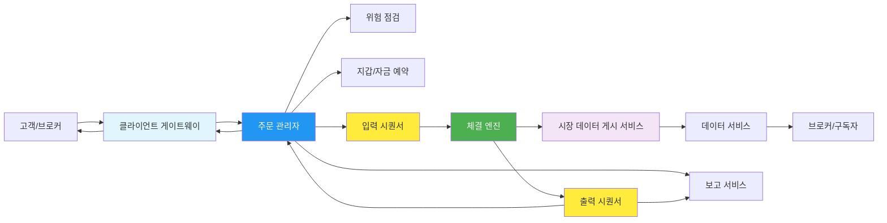
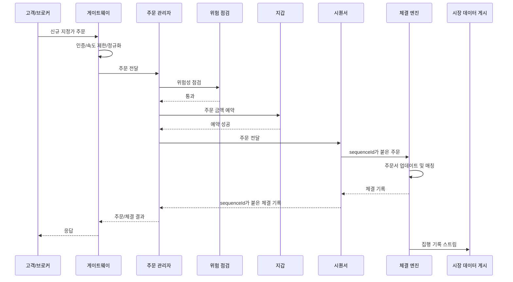
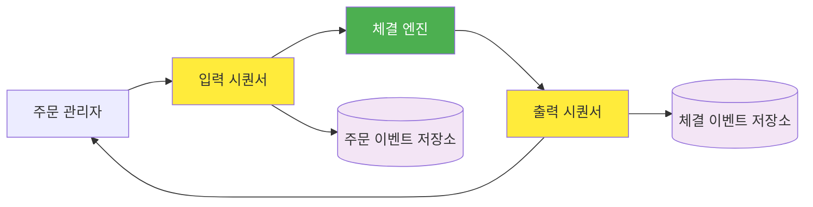
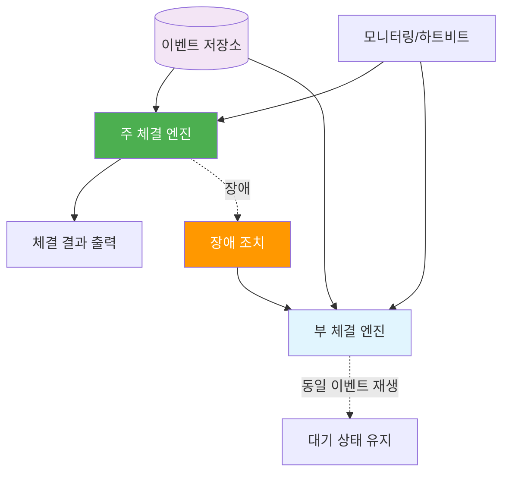
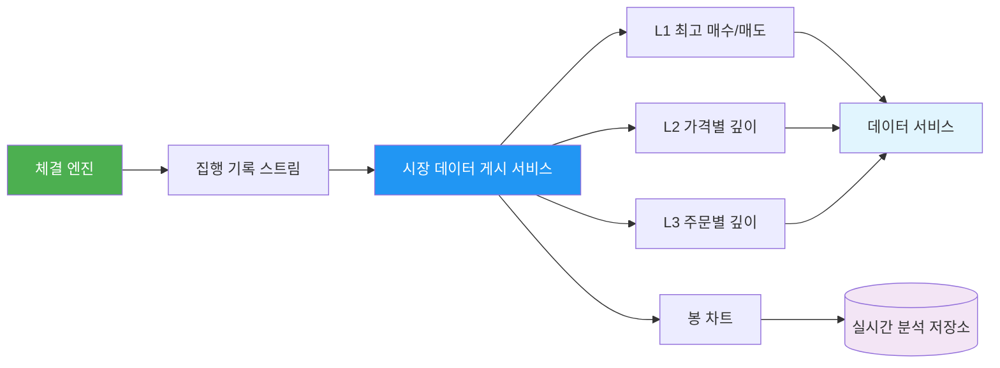

# 13장 증권 거래소 (Stock Exchange) 발표 자료

> **발표자**: 길현준

---

## 목차

1. [1단계: 문제 이해 및 설계 범위 확정](#1-1단계-문제-이해-및-설계-범위-확정)
2. [2단계: 개략적 설계](#2-2단계-개략적-설계)
3. [3단계: 상세 설계](#3-3단계-상세-설계)
4. [면접 질문 Q&A](#4-면접-질문-qa)
5. [토론 주제](#5-토론-주제)
6. [참고 자료](#6-참고-자료)

---

## 1. 1단계: 문제 이해 및 설계 범위 확정

### 증권 거래소란?

**정의**: 증권 거래소는 매수자와 매도자의 주문을 공정하고 빠르게 연결하고, 체결 결과와 시장 데이터를 실시간으로 배포하는 거래 시스템입니다.

**핵심 특징**:
- **낮은 지연 시간**: 주문이 들어와 체결 결과가 반환되기까지의 시간이 매우 짧아야 합니다.
- **결정론적 체결**: 같은 순서의 주문이 들어오면 항상 같은 체결 결과가 나와야 합니다.
- **고가용성**: 체결 엔진이나 주문 관리자가 장애를 일으키면 거래소 전체에 큰 영향을 줍니다.
- **감사 가능성**: 주문, 체결, 시장 데이터 흐름을 재생하고 보고할 수 있어야 합니다.

### ★ 요구사항 도출 (면접 대화 요약)

**지원자**: 새 주문, 주문 취소, 주문 교체 중 어떤 유형을 지원해야 하나요? 지정가 주문, 시장가 주문, 조건부 주문을 모두 지원해야 하나요?  
**면접관**: 새 주문을 넣을 수 있고, 체결되지 않은 주문은 취소할 수 있어야 합니다. 주문 유형은 지정가 주문만 지원한다고 하겠습니다.

**지원자**: 사용자 수, 증권 수, 주문 수 같은 규모 조건을 설명해 주실 수 있을까요?  
**면접관**: 최소 수만 명 사용자를 지원하고, 하루에 수십억 건의 주문이 발생할 수 있다고 가정합시다.

**지원자**: 주문 전 지갑이나 위험성 점검도 고려해야 하나요?  
**면접관**: 그렇습니다. 주문 전에 충분한 자금이 있는지 확인해야 하고, 체결되지 않은 주문에 묶인 자금은 다른 주문에 다시 쓰일 수 없어야 합니다.

### 기능 요구사항

| 요구사항 | 세부 내용 |
|----------|----------|
| 신규 지정가 주문 | 가격과 수량이 지정된 매수/매도 주문 접수 |
| 주문 취소 | 아직 체결되지 않은 주문 취소 |
| 체결 알림 | 주문이 체결되면 고객에게 실시간으로 결과 전달 |
| 호가 창/주문서 제공 | L1/L2/L3 수준의 시장 데이터 제공 |
| 위험성 점검 | 주문 전 자금, 규칙, 거래 가능 여부 확인 |
| 보고 | 주문 및 체결 기록을 기반으로 보고/정산/감사 지원 |

### 비기능 요구사항

- **낮은 지연 시간**: 중요 거래 경로는 주문 접수부터 체결 결과 반환까지 가능한 짧아야 합니다.
- **고처리량**: 하루 수십억 건 주문을 처리할 수 있어야 합니다.
- **결정론적 처리**: 장애 복구와 재생을 위해 같은 입력 순서는 같은 출력 순서를 만들어야 합니다.
- **고가용성**: 주 체결 엔진 장애 시 부 체결 엔진 또는 대체 서버로 빠르게 복구해야 합니다.
- **공정성**: 시장 데이터는 특정 구독자에게만 먼저 도착하지 않도록 공정하게 배포되어야 합니다.

### 규모 추정 (Back-of-envelope)

```text
가정:
- 하루 주문 수 = 1,000,000,000건
- 거래 시간 = 6.5시간 = 23,400초

평균 주문 QPS = 1,000,000,000 / 23,400 ≈ 42,735 orders/sec
피크 트래픽 = 평균의 5배 가정 ≈ 213,675 orders/sec

체결 결과는 매수/매도 양쪽 실행 기록을 만들 수 있음:
피크 실행 기록 스트림 ≈ 주문 피크 × 2 ≈ 427,350 events/sec
```

> 이 계산은 정확한 용량 산정이라기보다, 왜 데이터베이스 중심 설계가 아니라 메모리 기반 체결과 이벤트 로그/시퀀서 중심 설계가 필요한지 보여 주는 기준선입니다.

---

## 2. 2단계: 개략적 설계

### ★ 이전 장과의 비교

| 구분 | 12장 전자 지갑 | 13장 증권 거래소 |
|------|----------------|------------------|
| 핵심 상태 | 계좌 잔액 | 주문 상태, 호가 창, 체결 기록 |
| 핵심 불변식 | 돈이 사라지거나 생기면 안 됨 | 주문 순서와 체결 결과가 결정론적이어야 함 |
| 주요 패턴 | 이벤트 소싱, 지갑 상태 재생 | 이벤트 소싱, 시퀀서, 체결 엔진, 시장 데이터 게시 |
| 지연 시간 민감도 | 높음 | 매우 높음, 특히 중요 거래 경로 |
| 복구 방식 | 이벤트 재생으로 잔액 복구 | 주문/체결 이벤트 재생으로 주문서와 체결 상태 복구 |

### API 설계

개인 고객은 브로커의 웹/모바일 앱을 통해 REST API와 비슷한 인터페이스로 거래소에 접근할 수 있습니다. 기관 고객은 낮은 지연 시간이 필요하므로 FIX 또는 바이너리 인코딩 기반 프로토콜이 더 적합합니다.

**신규 주문**

```http
POST /v1/orders
Authorization: Bearer <token>
Content-Type: application/json

{
  "symbol": "AAPL",
  "side": "buy",
  "price": "100.05",
  "quantity": 100,
  "orderType": "limit",
  "clientOrderId": "client-generated-id"
}
```

**주문 취소**

```http
DELETE /v1/orders/{orderId}
```

**체결 조회**

```http
GET /v1/executions?symbol=AAPL&orderId={orderId}
```

**호가 창/시장 데이터 조회**

```http
GET /v1/market-data/{symbol}/order-book?level=2
GET /v1/market-data/{symbol}/candles?interval=1m
```

| Method | Endpoint | 설명 |
|--------|----------|------|
| POST | `/v1/orders` | 신규 지정가 주문 접수 |
| DELETE | `/v1/orders/{orderId}` | 미체결 주문 취소 |
| GET | `/v1/orders/{orderId}` | 주문 상태 조회 |
| GET | `/v1/executions` | 체결 기록 조회 |
| GET | `/v1/market-data/{symbol}/order-book` | L1/L2/L3 호가 창 조회 |
| GET | `/v1/market-data/{symbol}/candles` | 봉 차트 데이터 조회 |

### 개략적 아키텍처



### 주요 컴포넌트

| 컴포넌트 | 역할 | 설계 포인트 |
|----------|------|-------------|
| 클라이언트 게이트웨이 | 인증, 속도 제한, 입력 정규화, FIX/SBE 변환 | 중요 경로에 있으므로 가볍게 유지 |
| 주문 관리자 | 주문 상태 관리, 위험 점검, 자금 예약, 체결 결과 반영 | 이벤트 소싱과 결합하면 복구가 쉬움 |
| 위험 점검 | 사용자의 주문 가능 여부 확인 | 복잡한 규칙은 중요 경로 밖으로 분리 필요 |
| 지갑 | 주문 전 자금 확인 및 미체결 주문 자금 예약 | 12장 전자 지갑 설계와 연결 |
| 시퀀서 | 주문과 체결 기록에 순서 ID 부여 | 결정론적 체결과 재생의 핵심 |
| 체결 엔진 | 주문서 유지, 매수/매도 주문 매칭, 실행 기록 생성 | 단일 스레드/CPU pinning으로 지연 최소화 |
| MDP | 체결 결과로 L1/L2/L3, 봉 차트 생성 | 구독자에게 시장 데이터 공정 배포 |
| 보고 서비스 | 주문/체결 기록 기반 보고와 감사 | 지연 시간 요구가 낮아 거래 경로와 분리 |

### 주문 처리 흐름



---

## 3. 3단계: 상세 설계

### 체결 엔진과 주문서 자료 구조

체결 엔진은 각 심벌의 주문서(order book)를 유지합니다. 주문서는 가격별 매수/매도 주문 큐입니다. 지정가 주문이 들어오면 반대편 주문서의 가격 조건을 확인하고, 체결 가능한 주문을 FIFO 순서로 매칭합니다.

주문서가 만족해야 하는 핵심 연산은 다음과 같습니다.

| 연산 | 목표 복잡도 | 이유 |
|------|-------------|------|
| 신규 주문 추가 | O(1) | 가격 수준의 큐 tail에 추가 |
| 주문 체결 | O(1) | 가격 수준의 큐 head부터 체결 |
| 주문 취소 | O(1) | `orderId -> order node` 맵과 이중 연결 리스트 사용 |
| 최고 매수/최저 매도 조회 | 빠른 조회 | 체결 조건 판단에 계속 사용 |

단일 연결 리스트만 사용하면 주문 취소 시 이전 노드를 찾기 위해 순회가 필요합니다. 그래서 책에서는 주문 노드가 이전/다음 포인터를 가지는 이중 연결 리스트와 `orderMap`을 함께 사용하는 방향을 설명합니다.

### FIFO 체결 알고리즘

```text
while incomingOrder.remainingQuantity > 0:
    bestOppositePriceLevel = oppositeBook.bestPrice()

    if price does not cross:
        break

    restingOrder = bestOppositePriceLevel.head
    matchedQuantity = min(incomingOrder.remainingQuantity, restingOrder.remainingQuantity)

    createExecution(buyOrder, sellOrder, matchedQuantity, executionPrice)
    decrease both remaining quantities

    if restingOrder is fully filled:
        remove restingOrder from price level and orderMap

if incomingOrder still has remaining quantity:
    add incomingOrder to own side order book
```

이 알고리즘은 같은 가격 수준 안에서는 먼저 들어온 주문을 먼저 체결하는 FIFO 규칙을 사용합니다. 다른 체결 알고리즘도 있을 수 있지만, 이 장의 설계에서는 결정론과 설명 가능성을 위해 FIFO를 기준으로 봅니다.

### 시퀀서와 결정론

시퀀서는 체결 엔진 앞뒤에 위치합니다. 입력 시퀀서는 주문에 순서 ID를 붙이고, 출력 시퀀서는 체결 기록에도 순서 ID를 붙입니다.



시퀀서가 중요한 이유는 두 가지입니다.

1. **순서 보장**: 동시에 들어온 주문도 하나의 전역 순서로 정렬됩니다.
2. **복구와 재생**: 장애가 나도 같은 이벤트를 같은 순서로 재생하면 같은 주문서와 체결 결과를 복구할 수 있습니다.

### 주문 관리자와 이벤트 소싱

주문 관리자는 주문 상태를 관리합니다. 신규 주문, 주문 취소, 체결 이벤트가 모두 상태 전이를 만듭니다. 상태만 저장하면 장애 복구 시 왜 그런 상태가 되었는지 추적하기 어렵습니다. 반대로 이벤트 소싱을 사용하면 모든 변경 이력이 남기 때문에 재생과 감사가 가능합니다.

| 방식 | 장점 | 단점 |
|------|------|------|
| 현재 상태 DB 저장 | 조회가 단순함 | 상태가 왜 그렇게 되었는지 추적이 어려움 |
| 이벤트 소싱 | 재생, 감사, 복구에 강함 | 이벤트 저장소와 재생 로직이 필요 |
| 이벤트 소싱 + 스냅샷 | 빠른 복구와 감사성 균형 | 스냅샷 생성/검증 복잡도 추가 |

이 장에서는 12장 전자 지갑과 마찬가지로 이벤트 소싱이 중요한 역할을 합니다. 다만 거래소에서는 지갑 잔액뿐 아니라 주문 상태, 주문서, 체결 결과, 시장 데이터까지 중요 거래 흐름에 얽혀 있기 때문에 지연 시간 제약이 더 강합니다.

### 낮은 지연 시간 최적화

책에서 강조하는 낮은 지연 시간 방향은 단순합니다. 중요 거래 경로에서 불필요한 네트워크 왕복, 디스크 접근, 락 경합, 컨텍스트 스위치를 줄여야 합니다.

| 최적화 | 설명 | 트레이드오프 |
|--------|------|--------------|
| 중요 경로에서 DB 쓰기 제거 | 주문/체결은 메모리와 이벤트 로그 중심으로 처리 | 장 마감/보고용 저장 경로를 별도로 둬야 함 |
| 단일 스레드 이벤트 루프 | 주문 관리자/체결 엔진을 CPU 코어에 고정 | 수평 확장은 심벌 파티셔닝 등으로 해결해야 함 |
| FIX → SBE 변환 | 게이트웨이에서 빠른 바이너리 인코딩으로 변환 | 구현 복잡도 증가 |
| mmap/링 버퍼 | 시퀀서와 이벤트 저장소의 지연 시간 감소 | 운영/복구 난이도 증가 |

### 고가용성 설계

체결 엔진은 상태를 가지므로 단순히 서버를 하나 더 띄운다고 해결되지 않습니다. 주 체결 엔진과 부 체결 엔진이 같은 이벤트를 같은 순서로 처리하게 해야 합니다.



장애 복구에서 확인해야 할 질문은 다음 네 가지입니다.

| 질문 | 의미 |
|------|------|
| 무엇을 장애로 볼 것인가? | 프로세스 다운, 하트비트 누락, 지연 시간 초과 등 |
| 누가 장애 조치를 결정하는가? | 수동 운영, 자동 모니터링, 클러스터 컨트롤러 |
| RTO는 얼마인가? | 얼마나 빨리 복구해야 하는가 |
| RPO는 얼마인가? | 어느 정도 데이터 손실을 허용할 수 있는가 |

거래소에서는 RPO를 거의 0에 가깝게 봐야 합니다. 주문과 체결 기록이 유실되면 단순 장애가 아니라 정산/감사 문제로 이어집니다.

### 시장 데이터 게시 서비스 최적화

MDP(Market Data Publisher)는 체결 엔진의 집행 기록 스트림을 받아 시장 데이터를 만듭니다. L1/L2/L3 호가 창, 봉 차트, 실시간 분석용 데이터가 여기서 만들어집니다.



시장 데이터는 공정하게 배포되어야 합니다. 특정 구독자가 다른 구독자보다 먼저 데이터를 받으면 거래상 이점이 생길 수 있습니다. 그래서 MDP는 단순한 조회 서비스가 아니라 공정성과 지연 시간을 함께 다뤄야 하는 중요한 구성요소입니다.

---

## 4. 면접 질문 Q&A

### Q1. 체결 엔진이 결정론적이어야 하는 이유는 무엇인가요?

> **답변:** 같은 주문 입력 순서에 대해 항상 같은 체결 결과가 나와야 장애 복구와 재생이 가능합니다. 주 체결 엔진과 부 체결 엔진이 같은 이벤트를 처리했는데 결과가 다르면 어떤 체결 결과가 맞는지 판단할 수 없습니다. 그래서 시퀀서가 주문과 체결 기록에 순서 ID를 붙이고, 체결 엔진은 그 순서대로만 상태를 변경해야 합니다.

### Q2. 주문과 체결 기록을 중요 거래 경로에서 바로 데이터베이스에 쓰지 않는 이유는 무엇인가요?

> **답변:** 데이터베이스 쓰기는 네트워크 왕복, 디스크 I/O, 락 경합을 만들 수 있어 낮은 지연 시간 요구사항에 불리합니다. 거래소의 중요 경로에서는 메모리 기반 체결과 시퀀서/이벤트 로그를 우선 사용하고, 보고나 장기 보관은 별도 흐름에서 처리하는 것이 더 적합합니다.

### Q3. 주문 취소를 O(1)에 가깝게 처리하려면 어떤 자료 구조가 필요한가요?

> **답변:** 가격 수준별 주문 큐만 있으면 취소 대상 주문을 찾기 어렵습니다. `orderId -> order node` 맵을 두고, 각 가격 수준의 주문 목록은 이중 연결 리스트로 관리하면 주문을 바로 찾고 이전/다음 포인터를 조정해 O(1)에 가깝게 삭제할 수 있습니다.

### Q4. 클라이언트 게이트웨이에 많은 기능을 넣으면 왜 위험한가요?

> **답변:** 게이트웨이는 중요 거래 경로의 앞단에 있기 때문에 지연 시간에 민감합니다. 인증, 속도 제한, 입력 정규화처럼 반드시 필요한 기능은 수행하되, 복잡한 위험 점검이나 무거운 비즈니스 로직은 별도 컴포넌트로 분리하는 편이 좋습니다. 게이트웨이가 무거워지면 모든 주문의 지연 시간이 증가합니다.

### Q5. 시장 데이터 배포에서 공정성이 중요한 이유는 무엇인가요?

> **답변:** 시장 데이터는 거래 판단의 근거입니다. 특정 구독자가 남들보다 먼저 체결 정보나 호가 변화를 받으면 부당한 거래 이점을 얻을 수 있습니다. 규제를 받는 거래소에서는 지연 시간뿐 아니라 모든 구독자에게 가능한 공정하게 데이터를 배포하는 것도 설계 요구사항입니다.

---

## 5. 토론 주제

### 토론 1: 낮은 지연 시간과 안전성 중 어디까지 타협할 수 있을까?

**질문**: 중요 거래 경로에서 데이터베이스 쓰기를 제거하면 지연 시간은 줄지만, 복구와 감사 설계가 더 어려워집니다. 어느 정도까지 성능을 위해 구조를 복잡하게 가져가도 괜찮을까요?

**토론 포인트**:
- 거래소와 일반 주문 시스템의 지연 시간 요구 차이
- 이벤트 로그/시퀀서가 DB 트랜잭션을 대체할 수 있는 조건
- 운영팀이 감당할 수 있는 복잡도의 한계

### 토론 2: 체결 알고리즘은 기술 문제인가, 정책 문제인가?

**질문**: FIFO 체결은 이해하기 쉽고 공정해 보이지만, 실제 시장에서는 다양한 체결 알고리즘이 존재합니다. 체결 알고리즘 선택은 시스템 설계자가 결정해야 할까요, 아니면 거래소 정책과 상품 특성에 따라 결정해야 할까요?

**토론 포인트**:
- FIFO, pro-rata 등 알고리즘이 사용자 경험에 미치는 영향
- 알고리즘 변경이 시스템 재현성과 감사에 미치는 영향
- 기술 설계와 시장 규칙의 경계

### 토론 3: 시장 데이터의 공정한 배포를 어떻게 검증할까?

**질문**: 모든 구독자에게 시장 데이터가 동시에 도착하도록 보장하는 것은 현실적으로 어렵습니다. 그렇다면 시스템은 어떤 지표와 테스트로 공정성을 증명해야 할까요?

**토론 포인트**:
- 구독자별 지연 시간 분포 측정
- 코로케이션 고객과 일반 고객의 차이
- 장애나 피크 트래픽 상황에서의 데이터 배포 정책

---

## 6. 참고 자료

- Alex Xu, *가상 면접 사례로 배우는 대규모 시스템 설계 기초 2*, 13장 증권 거래소
- FIX Trading Community: https://www.fixtrading.org/
- NYSE matched volume: https://www.nyse.com/
- CME Globex matching algorithm 관련 자료

---

*Last Updated: 2026-07-02*
